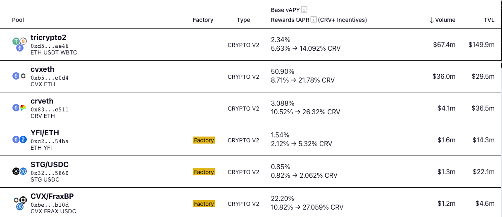

Начать работу с Curve непросто — здесь много информации, и уникальный интерфейс может поначалу показаться сложным. Это небольшое руководство предназначено для начинающих пользователей Curve, имеющих понимание DeFi и криптовалют. Оно помогает ответить на частые вопросы о том, как начать работать с Curve и как платформа приносит прибыль провайдерам ликвидности.

# **Что такое Curve.fi?** {#what-is-curvefi}

Проще всего понять Curve как обменник. Его основная цель — позволить пользователям и другим децентрализованным протоколам **обменивать токены ERC-20 (например, DAI на USDC) с низкими комиссиями и низким проскальзыванием**. В отличие от бирж, которые связывают покупателя и продавца, Curve использует пулы ликвидности. Для успешного обмена Curve нуждается в высоком объёме ликвидности (токенов), поэтому предоставляет вознаграждения **провайдерам ликвидности**.

Curve — **некастодиальная платформа**, то есть разработчики Curve не имеют доступа к вашим токенам. Пулы Curve также не могут быть обновлены, что гарантирует, что логика, защищающая ваши средства, никогда не изменится.

# **Что такое пулы ликвидности и зачем мне вносить средства?**

Пулы ликвидности — это пулы токенов, хранящиеся в смарт-контрактах, которые позволяют пользователям обменивать или выводить токены по установленным ставкам. Добавляя ликвидность в пул Curve, вы зарабатываете пассивный доход за счёт торговых комиссий, с вознаграждением, зависящим от вашего вклада. Также вы можете получать дополнительные бонусы, такие как токены CRV или баллы, увеличивающие ваш доход. Предоставление ликвидности также помогает поддерживать эффективные и недорогие сделки для всех участников, что выгодно всей экосистеме DeFi.

Подробнее читайте в разделе:

[**Понимание пулов Curve**](../lp/overview.md)

# **Сколько стоит обмен через Curve?** {#what-are-liquidity-pools-why-should-i-deposit}

Комиссии различаются для разных пулов. В большинстве случаев они составляют от 0,01% до 0,4%. В новых пулах комиссии могут быть динамическими, и в случае высокого спроса они могут увеличиваться. Текущая комиссия указана на странице каждого пула.

# **Что означают проценты рядом с каждым пулом?** {#what-are-those-percentages-next-to-each-pool}

В интерфейсе Curve рядом с пулами может отображаться несколько разных процентов.

Первая колонка, vAPY, показывает годовую процентную ставку дохода от торговых комиссий, заработанных провайдерами ликвидности. Сделки через пулы Curve генерируют комиссии, часть которых начисляется всем, кто внёс ликвидность в пул. Подробнее читайте в разделе [Провайдеры ликвидности](../lp/overview.md).

Вторая колонка относится к вознаграждениям (reward gauges). Это позволяет провайдерам ликвидности получать бонусные токены CRV. Подробнее об этих бонусах читайте в разделе [Вознаграждения](../reward-gauges/overview.md).

# **Что такое токен CRV?** {#what-is-the-crv-token}

CRV — это токен управления и утилитарный токен для Curve.

[**Понимание CRV**](../crv-token/overview.md)

[**Понимание управления**](../governance/understanding-governance.md)

# **Можно ли использовать Curve на сайдчейнах?** {#can-i-use-curve-on-sidechains}

Да, Curve запущен на нескольких сайдчейнах и продолжит их поддержку. Для получения дополнительной информации посетите наш раздел о Multichain.

# **Как создать новый пул?** {#how-can-i-launch-a-pool}

Все новые пулы Curve разворачиваются без разрешений через Curve Factory. Это значит, что любой может запустить пул в любое время и в любом месте. Полное руководство доступно в разделе о Factory Pools.

# **Почему Curve так быстро вырос?** {#why-has-curve-grown-so-quickly}

После запуска Curve быстро вырос, обеспечив доступ к развивающемуся рынку стейблкоинов. Стейблкоины стали неотъемлемой частью криптовалютного рынка, но теперь они представлены в разных вариантах (DAI, TUSD, sUSD, bUSD, USDC и так далее), что создаёт спрос на их обмен. Централизованные биржи взимают высокие комиссии, что затрудняет переход от одного стейблкоина к другому. Поэтому Curve.fi стал лучшим местом для обмена стейблкоинов благодаря низким комиссиям и низкому проскальзыванию.

Недавно Curve запустил v2 Crypto Pools, чтобы предоставить такую же простоту и эффективность, как и в стейблкоиновых пулах, для транзакций между активами с разной стоимостью (например, BTC и ETH). Эти пулы достаточно отличаются, чтобы заслуживать отдельного раздела.

# **Где можно найти смарт-контракты Curve?** {#where-can-i-find-curve-smart-contracts}

[**GitHub репозиторий**](https://github.com/curvefi) открывает основной код и активность разработки Curve.

# **Whitepaper** {#whitepaper}

!!!pdf "Whitepaper StableSwap (Curve V1)"
    Для подробного обзора Curve V1 ознакомьтесь с официальным [**whitepaper**](../pdf/curve-stableswap.pdf).

