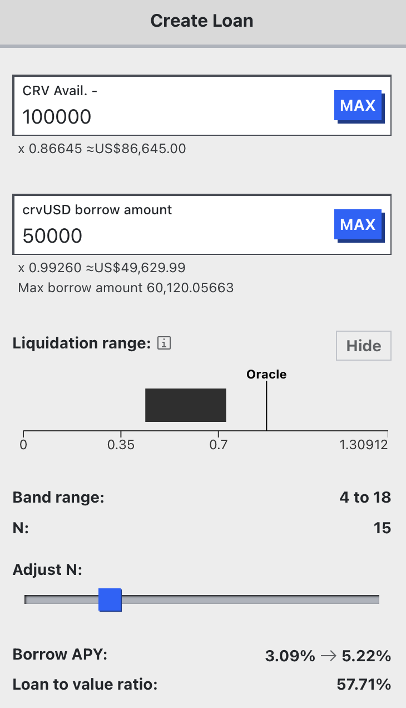

<h1>How to Borrow</h1>

## **Borrowing UI**

When selecting the **`"BORROW"`** tab from the [main UI](https://lend.curve.fi/#/ethereum/markets), all relevant market information and values for borrowers are displayed:

<figure markdown="span">
  { width="800" }
  <figcaption></figcaption>
</figure>

`Collateral` displays the collateral token of the market, while `Borrow` shows the token which can be borrowed. `Borrow APY` represents the current [borrow rate](./about.md#borrow-rate).

The `Available` column shows the amount of assets left to borrow and `Borrowed` is the total amount currently borrowed.

`Supplied` shows the total amount of the borrowable token which has been supplied by users.

The `Utilization (%)` is the ratio of `Borrowed` to `Supplied` tokens, see [here](./about.md#utilization-lend-apy-and-borrow-apy) for more information.

---

## **Creating A New Loan**

In order to create a loan and borrow tokens against collateral, a user first needs to choose a lending market. This can simply be done by clicking the desired market.

Having **`"Advanced Mode"`** activated when creating a loan allows the user to additionally select the number of bands for the loan and displays the corresponding liquidation range. If deactivated, the loan will be created with a default amount of 10 bands.

<figure markdown="span">
  { width="300" }
  <figcaption>Advanced Mode can be toggled on the top right of the page.</figcaption>
</figure>

!!!tip "Number of Bands (N)"
    A **higher number of bands results in fewer losses when the loan is in soft-liquidation** mode. The maximum number of bands is 50, while the minimum is 4.

<figure markdown="span">
  { width="300" }
  <figcaption></figcaption>
</figure>

Additionally, the UI shows the future borrow APY when the user's loan is created and the loan-to-value (LTV) ratio.

---

*Advanced mode also enables an overview of the entire LLAMMA including important values such as lend or borrow APY, available amount to borrow, etc.*

<figure markdown="span">
  { width="600" }
  <figcaption></figcaption>
</figure>

*Down below, a section containing relevant contracts and the current parameters for the lending market is displayed.*

<figure markdown="span">
  { width="600" }
  <figcaption></figcaption>
</figure>

- **`Fee`**: The current exchange fee for swapping tokens in the AMM.
- **`Admin Fee`**: The percentage of the total fee, which is awarded to veCRV holders. Currently, all fees go to liquidity providers in the AMM (which are the borrowers).
- **`A`**: The amplification parameter A defines the density of liquidity and band size.
- **`Loan Discount`**: The percentage used to discount the collateral for calculating the maximum borrowable amount when creating a loan.
- **`Liquidation Discount`**: The percentage used to discount the collateral for calculating the recoverable value upon liquidation at the current market price.
- **`Base Price`**: The base price is the price of the band number 0.
- **`Oracle Price`**: The oracle price is the current price of the collateral as determined by the oracle. The oracle price is used to calculate the collateral's value and the loan's health.

---

*Navigating to the `"Your Details"` tab displays all the user's loan details:[^1]*

[^1]: This tab will only show up if a user has a loan and their wallet is connected to the site.
 

<figure markdown="span">
  { width="600" }
  <figcaption></figcaption>
</figure>

---

## **Loan Management**

!!!info "Loan Management when in soft-liquidation mode"
    **During soft-liquidation, users are unable to add or withdraw collateral.** They can choose to **either partially or fully repay** their crvUSD debt to improve their health ratio **or** decide to **self-liquidate** their loan if their collateral composition contains sufficient crvUSD to cover the outstanding debt. If they opt for self-liquidation, the user's debt is fully repaid and the loan will be closed. Any residual amounts are then returned to the user.

Everything needed to manage a loan is available in the UI.

*The `"Manage Loan"` tab has the following options:*

<figure markdown="span">
  { width="400" }
  <figcaption></figcaption>
</figure>

- **`Borrow more`**: Borrowing more assets, while adding additional collateral (not necessary).
- **`Repay`**: Partially or fully repay debt.
- **`Self-liquidate`**: Close their loan via self-liquidation.

---

*The `"Collateral"` tab allows the adjustment of collateral:*

<figure markdown="span">
  { width="400" }
  <figcaption></figcaption>
</figure>

- **`Add collateral`**: Add more collateral to the loan.
- **`Remove collateral`**: Remove collateral from the loan.
