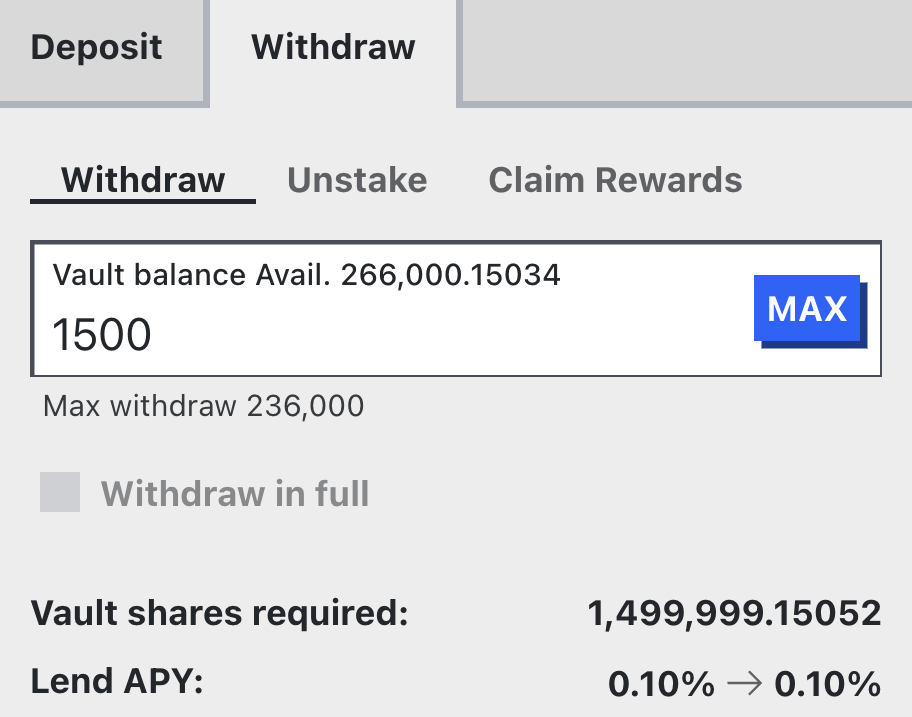

<h1>How to Supply (Lend)</h1>

## **Supplying UI**

By choosing the **`"SUPPLY"`** tab from the [main UI](https://lend.curve.fi/#/ethereum/markets), all relevant market information and values for lenders are displayed:

<figure markdown="span">
  { width="800" }
  <figcaption></figcaption>
</figure>

`Supply` shows the underlying token of the vault which can be supplied. `Lend APY` is the current annualized rate for doing so.

Additionally, vaults can have gauges, which are eligible to receive CRV emissions once they are added to the GaugeController. These rewards will show up in the `Rewards APR / CRV + Incentives` column if there are any.  See [here](./about.md#rewards-apr) for information about what's required to have CRV rewards.

`TVL` displays the total value locked into the vault.

---

## **How do Supply Vaults work?**

Liquidity for borrowers is provided in **ERC-4626 vaults**. For detailed documentation on how they work, please check out the official [Ethereum documentation](https://ethereum.org/de/developers/docs/standards/tokens/erc-4626/) or visit the [technical docs of Curve](https://docs.curve.fi/lending/contracts/vault/).

These vaults are **yield-bearing**, meaning there is **no need for the user to claim** awarded rewards for lending out their assets[^1]. The shares they receive for depositing assets into the vault **increase in value** because the balance of the underlying asset increases due to the dynamics of interest rates.

[^1]: This does not apply to rewards awarded from liquidity gauges. They need to be claimed under the `"Withdraw" -> "Claim Rewards"` tab.

---

## **Depositing Assets**

In order to supply tokens to the vault, the user must **specify the amount of underlying tokens to add**. Underlying tokens are referred to as the asset in the vault, which is the asset that's borrowed.  
When depositing, the UI previews the amount of shares to receive and projects the lend APY after the deposit. For depositing, there is no cap. Users can deposit as much as they want.

<figure markdown="span">
  { width="350" }
  <figcaption></figcaption>
</figure>

---

## **Staking Assets**

After depositing, if desired, users can stake their vault shares into the corresponding gauge (if there is one) under the **`"Stake"`** tab.  This allows the user to receive Rewards APR if there is any available.  Click on the `Deposit` -> `Stake` tab to deposit your assets.  By staking your supply vault shares you are sending them to the Rewards Gauge, you retain ownership, but they are nontransferable while staked.  Staking requires a transaction.

<figure markdown="span">
  { width="350" }
  <figcaption></figcaption>
</figure>

Liquidity gauges of vaults can be added to the GaugeController in order to be eligible to receive CRV emissions or external rewards can be added to the gauge by the deployer.

---

## **Unstaking Assets**

Unstaking withdraws your Vault Shares from the Rewards Gauge to your address.  It requires a transaction to unstake.  Unstaking and claiming rewards can be done together in a single transaction.  It can be done from the `Withdraw` -> `Unstake` tab of the Supply UI for the lending market you've supplied to.

<figure markdown="span">
  { width="350" }
  <figcaption></figcaption>
</figure>

You must `Unstake` your Vault shares before being able to `Withdraw`.

---

## **Withdrawing Assets**

If a user already has some shares, they can withdraw a desired amount of the underlying asset under the **`"Withdraw"`** tab. There is also a "Withdraw in full" option, which burns all the user's shares and converts them into the underlying asset[^2]. 

<figure markdown="span">
  { width="350" }
  <figcaption></figcaption>
</figure>

The UI previews the amount of shares to be burned in order to receive the underlying tokens. If a user has staked the vault shares in a gauge, they are required to unstake them under the **`"Unstake"`** tab before being able to withdraw.

[^2]: This method will only work if the vault has enough underlying assets to fully redeem all the shares. 

!!!tip "Lending Rates when Depositing or Withdrawing Assets"
    When depositing underlying assets into the vault, the lending rate may decrease depending on the amount of assets added. The reason for this is that when supplying additional assets, the market's [utilization rate](./understanding-lending.md#utilization-rate) will decrease (as there are now more assets to borrow from), which simultaneously decreases the borrow rate. When the borrow rate decreases, the lending rate decreases as well.

    Vice versa: Withdrawing assets from the vault reduces the total amount of assets. This drives the utilization rate up, which increases the borrow rate and therefore also the lending rate.  
    
    See [here](./about.md#utilization-lend-apy-and-borrow-apy) for more information about Utilization and how it affects lending and borrow rates

---

## **Claiming Rewards**

Any rewards from a **Rewards APR** will be available under the `Withdraw` -> `Claim Rewards` tab here:

<figure markdown="span">
  { width="350" }
  <figcaption></figcaption>
</figure>

Claiming rewards requires a transaction, however unstaking and claiming together can be done in a single transaction.

---

*Having **`"Advanced Mode"`** enabled adds a full overview of the vault.*

<figure markdown="span">
  { width="600" }
  <figcaption></figcaption>
</figure>

*If a user has shares, the user can view their personal vault information on the `"Your Details"` tab.*

<figure markdown="span">
  { width="600" }
  <figcaption></figcaption>
</figure>
