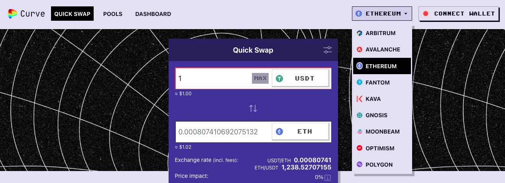
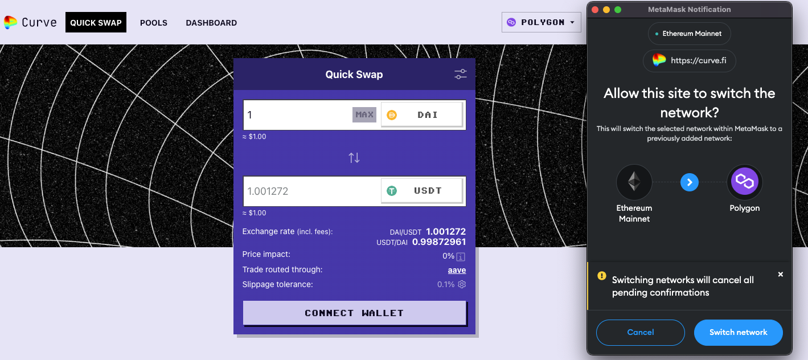

Curve существует на множестве блокчейн сетей, и планируется еще больше. Основной цепочкой Curve всегда будет Ethereum, но другие сайдчейны имеют преимущества, включая скорость и стоимость. Чтобы использовать Curve на других блокчейнах, вам обычно нужно отправить свои средства из Ethereum в сайдчейн, используя мост этого блокчейна.

Все активные блокчейны сети Curve можно найти в меню «Networks» на главной странице Curve.

> Поддерживаемые сайдчейны по состоянию на 14.11.2022

## **Подключение вашего кошелька** {#connecting-your-wallet}

Когда вы переходите на новые блокчейны, вам нужно подключить свой кошелек с помощью RPC и идентификатора цепочки. Обычно на страницах сайдчейнов Curve есть кнопка, которую вы можете нажать, чтобы автоматически переключить сеть и заполнить эту информацию для вас.

Распространенной проблемой с сайдчейнами являются RPC-сети, которые временно или постоянно недоступны. Если у вас возникают проблемы с подключением к RPC-сетям, вам может потребоваться посетить службы поддержки блокчейна, чтобы найти новую RPC-сеть.

## **Форки Curve** {#curve-forks}

!!!tip
    Для мостов и адресов контрактов CRV на других блокчейнах, пожалуйста, смотрите [*Важные мосты*](../multichain/understanding-multichain.md#).

Форки Curve включают:

### *Avalanche* {#avalanche}

Avalanche — это сайдчейн, который позиционирует себя как «молниеносно быстрый, недорогой и экологичный». Сайт Curve на Avalanche находится по адресу [https://avax.curve.fi/](https://avax.curve.fi/)

### *Arbitrum* {#arbitrum}

Arbitrum — это Optimistic Ethereum L2. Валидаторы Arbitrum _оптимистично_ предполагают, что узлы будут работать добросовестно, что позволяет быстрее выполнять транзакции. Однако, чтобы дать возможность ретроактивно оспорить злонамеренное поведение, время расчетов может быть медленнее. В некоторых случаях это может означать, что потребуется до недели, чтобы перенести средства вне блокчейна, поэтому планируйте соответственно.
Curve на Arbitrum: [https://curve.fi/#/arbitrum/pools](https://curve.fi/#/arbitrum/pools)

### *Binance Smart Chain* {#binance-smart-chain}

Curve не работает на Binance Smart Chain. Команда Ellipsis ([https://ellipsis.finance/](https://ellipsis.finance/)) запустила форк Curve, который предоставляет аналогичный функционал. Команда Curve разрешила этот форк, но не поддерживает этот проект активно.

### *Fantom* {#fantom}

Fantom — это высокопроизводительная, масштабируемая платформа смарт-контрактов, разработанная для преодоления ограничений традиционных блокчейн-сетей путем использования DAG-базированного алгоритма консенсуса.
Curve на Fantom: [https://curve.fi/#/fantom/pools](https://curve.fi/#/fantom/pools)

### *Harmony* {#harmony}

Harmony — это сайдчейн с доказательством доли владения (proof-of-stake), обещающий две секунды скорости транзакций и в сто раз более низкую комиссию за газ. Предложения Curve на Harmony находятся по адресу [https://harmony.curve.fi/](https://harmony.curve.fi/)

### *Optimism* {#optimism}

Optimism проверяется серией смарт-контрактов в основной сети Ethereum и, таким образом, не считается настоящим сайдчейном. Ветка Curve на Optimism находится по адресу [https://curve.fi/#/optimism/pools](https://curve.fi/#/optimism/pools)

### *Polygon* {#polygon}

Polygon (ранее известный как Matic Network) — это многосетевая масштабируемая решение для Ethereum, которое стремится обеспечить более быстрые и дешевые транзакции, используя сайдчейны второго уровня.
Curve на Polygon: [https://curve.fi/#/polygon/pools](https://curve.fi/#/polygon/pools)

### *xDai/Gnosis* {#xdai-gnosis}

Сеть xDai — это блокчейн стабильных платежей на основе EVM (Ethereum Virtual Machine), разработанный для быстрых и недорогих транзакций.
Curve на xDai/Gnosis: [https://curve.fi/#/xdai/pools](https://curve.fi/#/xdai/pools)

